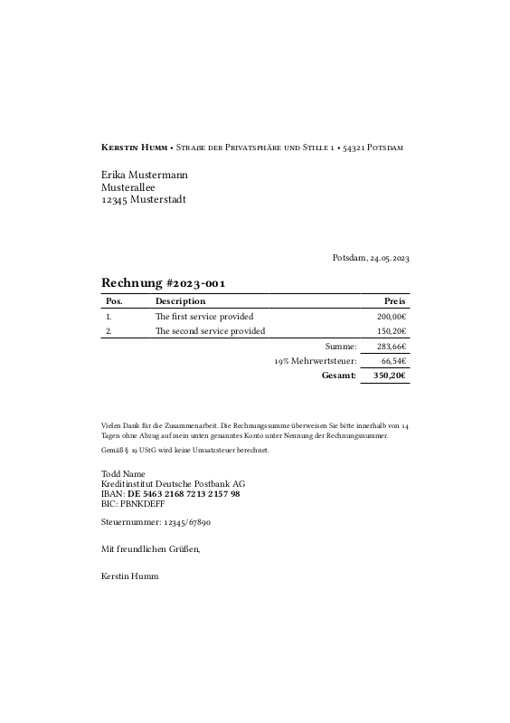

<!--
SPDX-FileCopyrightText: 2023 Kerstin Humm <kerstin@erictapen.name>

SPDX-License-Identifier: GPL-3.0-or-later
-->

# Typst invoice template



An template for writing invoices, which strives to be almost a copy of the [beautiful LaTex template by @mrzool](https://github.com/mrzool/invoice-boilerplate/).

The data for an individual invoice is stored in a TOML file (`invoice.toml`), so the important fields are easily identifiable and can even be produced by another program.

## Specifics

The entire template strives to work for the german region and locale, which is aquired through hacks, as Typst doesn't seem to have good support for locales yet. The reason for that is just that I personally needed it like this. You'll also find some other details that only fit my specific use case, e.g. the reference to the german § 19 UStG.

So it is very likely that you have to adapt the template to your use case. PRs that make the template usable by a wider audience are welcome.

## Building

For compiling the PDF file just run

```
typst compile invoice.typ invoice.pdf
```
